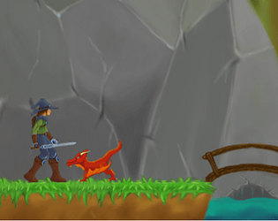
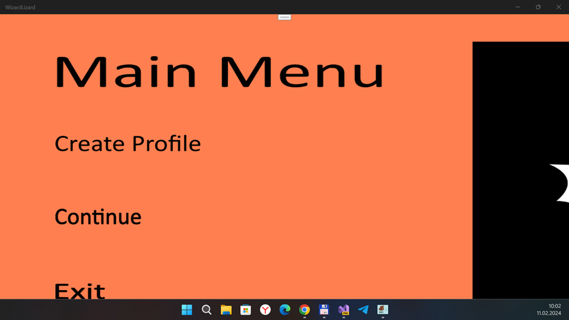
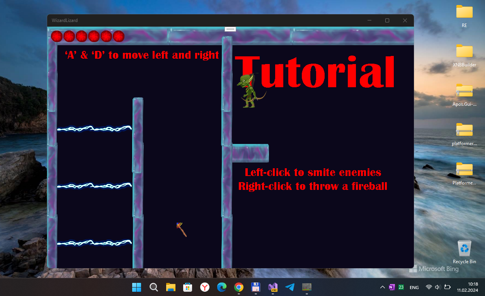

## WizardLizard v1.0.1  (uwp; pre-pre-alpha)

This is my fork of the desktop monogame "WizardLizard" demo project:
https://nielsjustesen.itch.io/wizard-lizard

My main goal is/was: adapdation for W10M (Astoria too). :) 

## Screenshot(s)

## My 2 cents (status)
- Fast R.E.... db connection not ready yet, sadly... So, game "unplayeble" :(
- Project tuned on(to) "firm" Monigame.Framwork 3.8.xx...
- "Game arch research" and minimal "reconstruct"...
- W10(M) UWP template ready... but all things damaged at now ("Game components" is hardcore!)
- Screen auto-resizing implemeted partially. 

## A few words (description) frow the author(original)

### Wizard Lizard
- When you have downloaded the game, and started it.
- Press create account before you press continue. So the save file is created to play from

### More information
- Status	Released
- Platforms	Windows
- Author	Niels Justesen Games
- Genre	Action
- Tags	2D

## Goals (ToDo-s)
- Create Wiki
- Explore super-cool object-oriented programming
- Fix Sqlite work
- Add more indicators / virtual gamepad, etc.
- Add more gameplay elements
- Improve AI
- Add story elements
- Add more sound effects for everything :)

## Reference(s)
- [WizardLizard](https://nielsjustesen.itch.io/wizard-lizard) WizardLizard indie game project at itch.io 
- [Niels Justesen Games](https://nielsjustesen.itch.io/) (gamestudeo-developer of original WizardLizard game)

## ..
As is. No support. RnD only. DIY.

## .
[m][e] 2024

